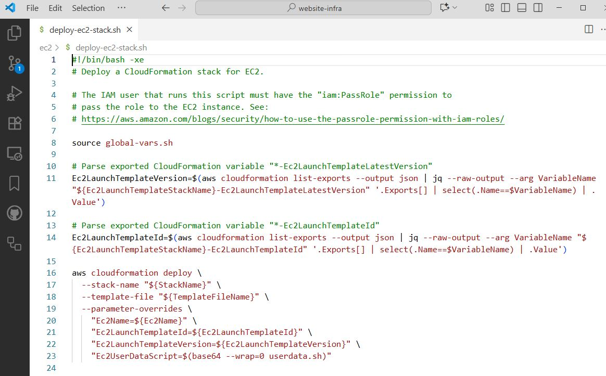

# AWS services for website development

## Purpose

This repository contains scripts that deploy AWS services for the development of
a personal website. The developer uses one EC2 instance to edit the source code
and test it.

The website's source code is in a separate private GitHub repository. This
repository only contains the AWS services.

The AWS services include:
1. EC2 launch template: Collection of parameters to create an EC2 instance.
1. EC2 instance: A "small" EC2 that can edit code and serve the code for development purpose.

## DevOps Concepts

The contents of this repository demonstrates several DevOps concepts:
1. **Automation**: The deployment of the AWS services is fully automated by shell scripts.

1. **Infrastructure-as-code**: The AWS services are defined by AWS CloudFormation templates.
1. **Continuous delivery**: This repository is integrated with GitHub Actions to trigger and execute the deployment.
